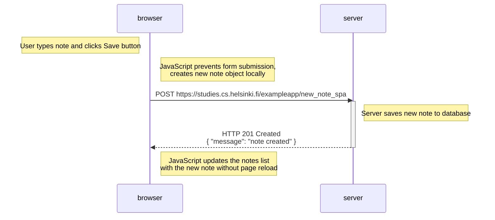

```mermaid
sequenceDiagram
    participant browser
    participant server

    Note left of browser: User types note and clicks Save button

    Note right of browser: JavaScript prevents form submission,<br/>creates new note object locally

    browser->>server: POST https://studies.cs.helsinki.fi/exampleapp/new_note_spa
    activate server
    Note right of server: Server saves new note to database
    server-->>browser: HTTP 201 Created<br/>{ "message": "note created" }
    deactivate server

    Note right of browser: JavaScript updates the notes list<br/>with the new note without page reload
```
